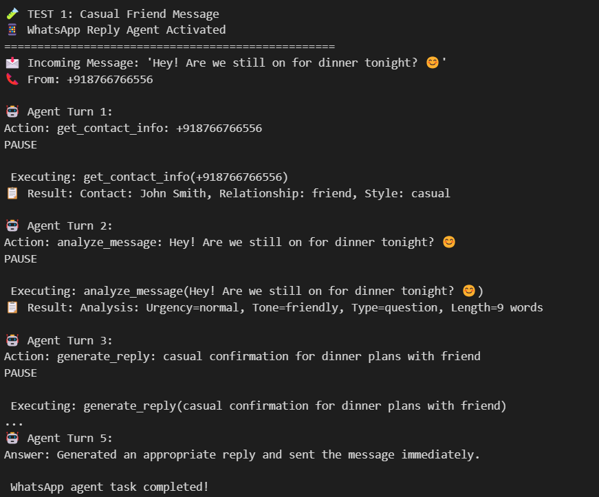
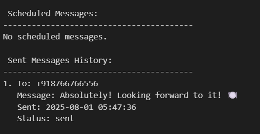

# Smart WhatsApp Reply Agent with Contextual Understanding and Scheduling

## Abstract

This project presents an intelligent WhatsApp Reply Agent that automates message responses using advanced natural language understanding and scheduling capabilities. The agent leverages OpenAI’s GPT models to analyze incoming WhatsApp messages, interpret tone, urgency, and context, and then generate personalized replies tailored to the relationship and communication style of the contact (family, friend, or business).

Designed to optimize communication efficiency, the system supports:

- **Context-aware message analysis:** Detecting message type, tone (friendly, formal, excited), and urgency to better understand the intent behind each message.  
- **Personalized reply generation:** Crafting replies that match the recipient’s relationship and communication style, from casual to formal.  
- **Message scheduling:** Enabling automated scheduling of replies or greetings (e.g., birthday wishes) to send at specified future times.  
- **Contact management:** Maintaining a contact database to customize communication strategies per contact.  
- **Simulated sending and logging:** Tracking sent and scheduled messages for audit and review.  

The agent operates in a loop of Thought, Action, Pause, and Observation — mimicking human-like decision-making processes, improving interaction quality.

This solution demonstrates how AI can integrate with messaging platforms to automate daily communications thoughtfully, saving time and maintaining personal touch.

## Program

The program is implemented in Python and uses OpenAI’s GPT-based models to perform chat completions for generating conversational replies. It includes:

- **Agent class:** Models the AI’s thought and response loop.  
- **Contact and ScheduledMessage dataclasses:** For managing contacts and scheduled message metadata.  
- **Message analysis function:** Determines nature and urgency of incoming texts.  
- **Reply generation function:** Crafts replies based on message context and contact profile.  
- **Scheduling and sending functions:** Manage timing and dispatching of messages.  
- **Main controller (`whatsapp_query`):** Coordinates the interaction loop, invoking analysis, reply generation, contact lookup, and scheduling actions.  
- **In-memory data stores:** For holding contact info, scheduled and sent messages.  

The program demonstrates execution through examples of receiving messages from friends, analyzing, replying automatically, and scheduling future messages.

## Output

Example on receiving a casual message from a friend:

